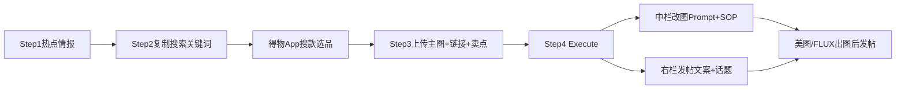
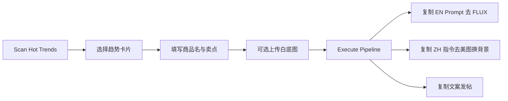

# Hype-Forge 使用手册

本文档面向日常运营：从安装、配置到「热点 → 生图 Prompt → 种草文案」的完整 SOP。

## 1. 产品是什么

Hype-Forge 默认定位为 **得物带货内容组装台**（亦支持小红书）。本地运行，不直接出图，而是帮你一次性准备好：

| 输出 | 用途 |
|------|------|
| **豆包生图提示词 + SOP** | 中栏：复制到豆包 App，上传 Step3 主图改背景 |
| 英文 FLUX / 分镜（高级折叠） | 可选备用生图流程 |
| **得物发帖三件套** | 右栏：标题、正文、话题标签（好物链接发帖时自行粘贴） |

典型场景：世界杯看球房周边、赛博桌搭、露营家居等**趋势带货图文**。

---

## 2. 环境要求

- **Node.js** 18+（推荐 20 LTS）
- **npm** 9+
- 可选：**阿里云百炼 DashScope API Key**（无 Key 时自动 Mock，可体验 UI）

---

## 3. 安装与启动

```bash
# 进入项目目录
cd Hype-Forge

# 安装依赖
npm install

# 配置环境变量
cp .env.example .env.local
# 用编辑器打开 .env.local，填入 DASHSCOPE_API_KEY

# 启动开发服务（推荐）
npm run dev:clean
```

浏览器打开：**http://localhost:3000**

生产部署：

```bash
npm run build
npm run start
```

---

## 4. 配置说明（.env.local）

| 变量 | 必填 | 说明 |
|------|------|------|
| `DASHSCOPE_API_KEY` | 否* | 百炼控制台获取的 `sk-` 开头 Key；无则 Mock |
| `DASHSCOPE_BASE_URL` | 否 | OpenAI 兼容端点，国内默认见 `.env.example` |
| `DASHSCOPE_MODEL` | 否 | 默认 `qwen3.6-plus`（多模态 + 可联网） |
| `FORGE_FORCE_MOCK` | 否 | `true` 时即使有 Key 也走 Mock，省额度调试 UI |
| `FORGE_TREND_QUERY` | 否 | 热点扫描默认关键词，如「2026世界杯 家居 潮品」 |

\* 使用真实 AI 能力时必填。

### 地域 Endpoint 对照

| 账号地域 | `DASHSCOPE_BASE_URL` |
|----------|----------------------|
| 中国大陆（北京） | `https://dashscope.aliyuncs.com/compatible-mode/v1` |
| 国际（新加坡等） | `https://dashscope-intl.aliyuncs.com/compatible-mode/v1` |

配置正确时，左栏顶部的状态徽标显示 **`LIVE · qwen3.6-plus`**；否则为 **`MOCK · offline`**。

> **安全**：切勿使用 `NEXT_PUBLIC_` 前缀暴露 API Key，Key 仅在后端 API 路由中读取。

---

## 5. 界面三栏说明

```
┌─────────────────┬──────────────────────┬─────────────────────┐
│  情报投喂区      │  视觉指挥官           │  多巴胺文案终端      │
│  (左)           │  (中)                │  (右)               │
│  输入 + 热点     │  EN/ZH 生图 Prompt   │  375px 手机框文案    │
└─────────────────┴──────────────────────┴─────────────────────┘
```

### 5.1 左侧 · 卖家四步向导

1. **热点情报** — Scan / 智能情报 / 场景趋势；智能识别品类·风格（无需手选）
2. **去得物搜货** — 复制关键词到 App；选品池收藏与验证
3. **你的商品素材** — **多图上传**（首张主图）、**整段粘贴**得物商品原文、**一个链接**（仅 AI 上下文）
4. **生成** — Execute + 流水线诊断

数据保存在浏览器 **localStorage**（选品池、发帖历史、Step3 粘贴/链接草稿、清单勾选）。

### 5.1.1 情报投喂（得物优先）

1. **Target Platform** — 默认 **得物**
2. **Scan 热点** — LIVE 时 DashScope **联网搜索**公开讨论（非得物官方榜单），缓存 30 分钟
3. **爆款线索 / 刷新** — 同上联网归纳单品方向；点 **刷新** 跳过缓存重新搜（**不自动拉图/链**）
4. **场景趋势** — 得物预设（球鞋/潮穿/桌搭）+ 通用场景 + 热点雷达结果
5. **商品主图** — 从得物 App 保存后上传（≤5MB）
6. **得物商品链接 / 好物链接** — 从 App 或创作者后台粘贴
7. **Product Name / Selling Points**
8. **Execute** — 完整流水线；运行中可 **Cancel**

执行后可能出现 **Vision Brief**（识图摘要：品类、颜色、材质）。

### 5.2 中间栏 · 豆包生图

- Execute 后：**豆包生图提示词**（一段中文，复制到豆包）+ **豆包作图 SOP**（3–5 步）
- 用法：在豆包上传 Step3 商品主图 → 粘贴提示词 → 导出图片
- 「高级 / 备用」折叠：FLUX EN、分镜（可选）

### 5.3 右侧 · 得物发帖

- 三卡片：**标题** | **正文** | **话题** — 各带一键复制（好物链接在 Step3 自行粘贴，不出现在正文）
- Step3 可填 **参考文案**（从商品页复制），与链接、主图一起优化生成；**不会爬取链接页面**
- 折叠区：Remix、发帖清单、评论话术、发帖历史、Critic
- **导出包** — 含豆包 Prompt、三件套、清单

### 5.4 中间栏 · 创意方向快选

Execute 完成后，点击 **创意方向** Chips 可局部改稿（`angle` Remix，见 `/api/forge/remix`）。

---

## 6. 得物带货 SOP（主推）

详见 [得物挂链与能力边界](DEWU-AFFILIATE.md)。



| 步骤 | 界面 | 你要做的 |
|------|------|----------|
| ① 热点情报 | Scan / 手写预设 / 一键智能情报 | 定种草场景（工具不代下单） |
| ② 去得物搜货 | **得物搜索关键词** 交接卡 | 复制关键词 → 得物 App 搜货选款；爆款线索仅为 AI 参考 |
| ③ 你的商品素材 | 多图 + 粘贴原文 + 商品链接 | 从 App 复制标题/详情/卖点；链接不写入右栏正文 |
| ④ 生成 | Execute | 中栏：改图 Prompt + 作图说明；右栏：文案 + `#话题`（本站不生图） |

**三种定热点方式**：预设场景下拉（手写）、情报搜索词 + Scan、一键智能情报（Scan + AI 参考爆款）。

---

## 7. 其他工作流（SOP）

### 流程 A：跟热点带货



1. 选择平台（小红书 / 得物）
2. 点击 **Scan Hot Trends**，等待 10–30 秒
3. 在趋势下拉中选一条（带 🔥 热度分），查看「种草角度」一行摘要
4. 填写商品名、卖点（扫描时会用商品信息优化关键词）
5. （推荐）上传白底商品图，提升 Prompt 与文案贴合度
6. 点击 **Execute Forge Pipeline**
7. 中间栏复制两段 Prompt → 第三方生图工具
8. 右侧复制全文 → 发帖

### 流程 B：固定场景快速出稿（不扫热点）

1. 趋势直接选预设，如「2026世界杯看球房」
2. 填表 → Execute（跳过 Scan，少 1 次调用）

### 流程 C：仅 Mock 演示（无 API Key）

1. 不配置 `DASHSCOPE_API_KEY` 或设置 `FORGE_FORCE_MOCK=true`
2. 界面照常可用，内容为模板插值，适合录屏、UI 验收

---

## 8. 流水线内部步骤（Execute 时）

| 顺序 | 步骤 | 说明 |
|------|------|------|
| 1 | vision（可选） | 有白底图时识图，生成 Vision Brief |
| 2 | visual | 生成英文 + 中文生图 Prompt |
| 3 | copy | 生成种草文案初稿 |
| 4 | critic | 质检并**最多修订 1 轮**（分数与 mustFix 展示在右侧） |
| 5 | 流式输出 | 将终稿文案以打字机效果推到右栏 |

左栏底部会显示当前步骤，例如 `流水线：critic…`。

### 模型调用次数（参考）

| 操作 | 次数 |
|------|------|
| Scan Hot Trends | 1 |
| Execute（无图） | 4 |
| Execute（有图） | 5 |

---

## 9. 预设趋势一览

**得物预设**：球鞋热度、潮穿街拍、数码桌搭

**通用**：

| ID | 名称 | 适用 |
|----|------|------|
| dewu-sneaker-heat | 得物球鞋热度 | 球鞋带货 |
| dewu-streetwear | 得物潮穿街拍 | 穿搭 OOTD |
| dewu-3c-desk | 得物数码桌搭 | 3C 桌搭 |
| worldcup-2026 | 2026世界杯看球房 | 通用场景 |

热点/爆款扫描结果出现在对应下拉分组。

---

## 10. 与外部工具衔接

### 生图（中间栏 EN Prompt）

1. 复制 **FLUX / Midjourney EN**
2. 在 FLUX / 即梦 / MJ 中：商品白底图 + 该 Prompt 生成场景图

### 换背景（中间栏 ZH 指令）

1. 复制 **背景重绘 ZH**
2. 在美图秀秀、醒图等：导入白底商品图 → AI 换背景 / 场景替换 → 粘贴中文指令

### 发帖（右侧文案）

1. 等待流式完成，点击 **全文** 复制
2. 粘贴到小红书 / 得物，按需微调排版与配图

---

## 11. 常见问题

### Q：页面白屏、没有样式、控制台 `_next/static` 404？

先 `Ctrl+C` 停 dev，再执行：

```bash
npm run dev:clean
```

浏览器硬刷新（`Cmd+Shift+R`）。不要交替运行 `build` 与 `dev` 而不清缓存。

### Q：顶栏一直是 MOCK · offline？

- 检查 `.env.local` 中 `DASHSCOPE_API_KEY` 是否正确
- 确认未设置 `FORGE_FORCE_MOCK=true`
- 修改 env 后需**重启** dev 服务

### Q：Scan 或 Execute 报错 / 超时？

- 核对 `DASHSCOPE_BASE_URL` 与账号地域一致
- 模型是否已开通 `qwen3.6-plus`
- 额度与 QPS 限制（429 时需稍后重试）

### Q：上传了图但没有 Vision Brief？

识图失败时会**静默降级**为纯文本表单，不阻断流水线；可换更清晰的白底图重试。

### Q：Critic 分数低怎么办？

查看右侧 **mustFix** 列表；若模型返回了修订稿，Execute 结果已是修订后版本。可调整卖点、换趋势后重新 Execute。

### Q：如何省 API 额度？

- 开发 UI：`FORGE_FORCE_MOCK=true`
- 同一平台 30 分钟内重复 Scan 会走**缓存**，不重复搜网
- 不需要识图时可不上传图片（少 1 次调用）

---

## 12. 更多文档

- [得物挂链说明](./DEWU-AFFILIATE.md) — API 现状、变现路径、能力边界
- [API 参考](./API.md) — 接口与 SSE 事件
- [README](../README.md) — 项目概览
